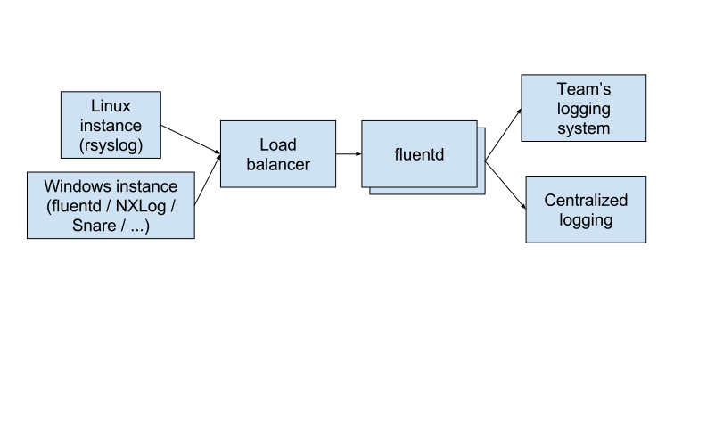

# DevSecOps Log Forwarding infrastructure 

This is a [Terraform](https://www.terraform.io/) module that creates infrastructure for collecting and forwarding logs. The module creates an autoscaling [fluentd](https://www.fluentd.org/) cluster in Amazon Web Services (AWS).

<!-- source: https://docs.google.com/drawings/d/1_-e_3ylSf9hkYK4S2f80Pqo9kJa0AoPTjSuG2vQpnGQ/edit -->

This is needed at [GSA](https://www.gsa.gov/) because we need logs to be forwarded to our security team for compliance and incident response reasons, as well as whatever logging system the team is using. It can be tricky to configure multiple logging endpoints for syslog agents on every instance; this way, changes to the forwarding can be done in one place.

For the "tenant's logging system", we recommend [our EKK stack](https://github.com/GSA/devsecops-ekk-stack).
